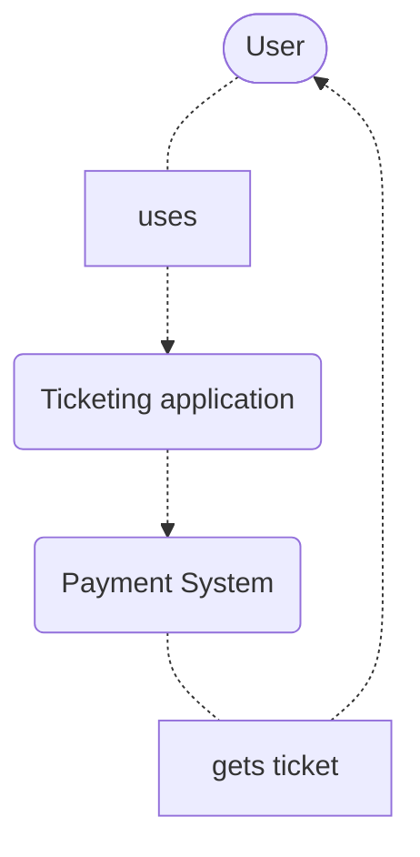
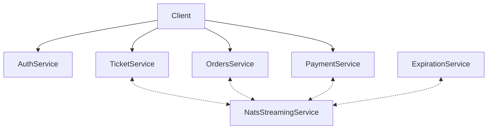
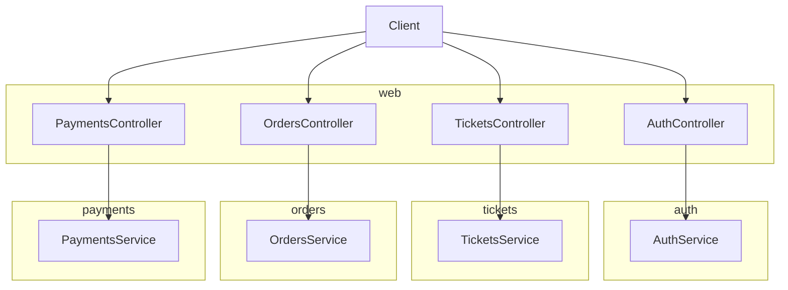
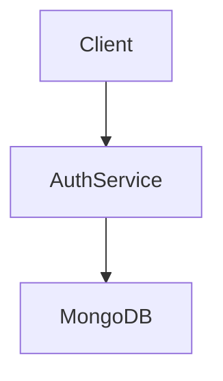
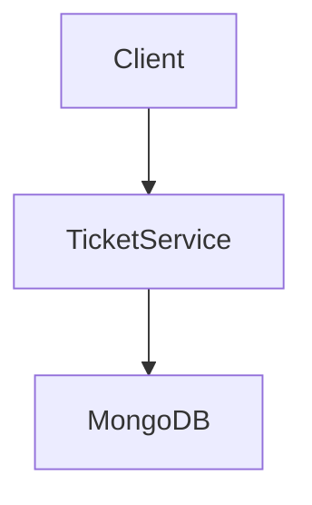
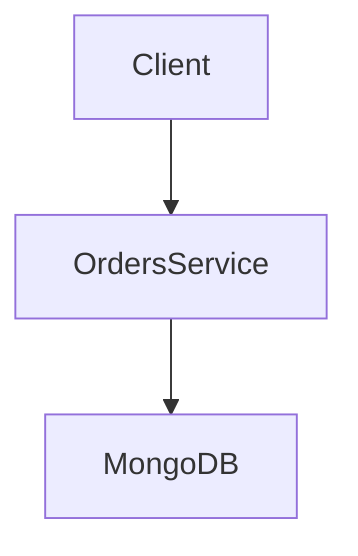
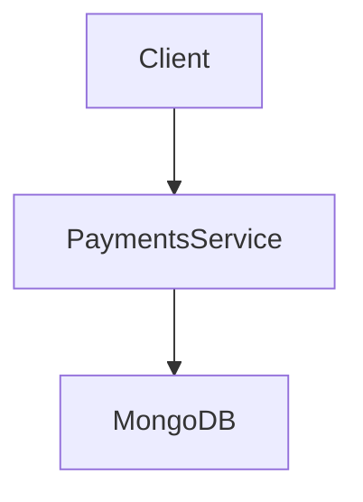

# NextJS Server Side Web Application +  ReactJS Microservices
This project is a proof of concept containing a SSR web client and a couple of back-end microservices all written using the ReactJS and TypeScript. This project is mainly used for learning purposes only.

## Functionalities
A <b>user</b> can:
 Functionality      | REST API | 
| :---        |    :----:   | 
| create a ticket that he wants to sell      | POST /api/tickets/new     | 
| see a list of all available tickets   | GET /api/tickets | 
| select a ticket to view more details | GET /api/tickets/:id |
| create an order to buy the ticket | POST /api/orders |
| pay for the ticket | POST /api/payments |
| see a list of orders completed(payed)/ cancelled | GET /api/orders |
---
# Diagrams

Below are presented some c4 diagrams.

## System diagram



# Container diagram (of Ticketing application)



# Component diagram (of Client)



# Component diagram (of AuthService)



# Component diagram (of TicketService)



# Component diagram (of OrdersService)



# Component diagram (of PaymentsService)



# Code diagram for tickets

```mermaid
classDiagram

    Publisher<|--TicketCreatedPublisher
    Publisher<|--TicketUpdatedPublisher
    Publisher : subject
    Publisher : client
    Publisher : publish()

    TicketCreatedPublisher : subject
    TicketCreatedPublisher : client
    TicketCreatedPublisher : publish()

    TicketUpdatedPublisher : subject
    TicketUpdatedPublisher : client
    TicketUpdatedPublisher : publish()

    Listener<|--OrderCreatedListener
    Listener<|--OrderCancelledListener
    Listener : subject
    Listener : queueGroupName
    Listener : onMessage()
    Listener : client
    Listener : ackWait
    Listener : listen()

    OrderCreatedListener : subject
    OrderCreatedListener : queueGroupName
    OrderCreatedListener : onMessage()
    OrderCreatedListener : client
    OrderCreatedListener : ackWait
    OrderCreatedListener : listen()

    OrderCancelledListener : subject
    OrderCancelledListener : queueGroupName
    OrderCancelledListener : onMessage()
    OrderCancelledListener : client
    OrderCancelledListener : ackWait
    OrderCancelledListener : listen()

    class Ticket 
    {
        id
        title
        price
        version
        userId
        orderId
    }

    Ticket <-- Index
    Ticket <-- New
    Ticket <-- Show
    Ticket <-- Update

    TicketCreatedPublisher <-- New
    TIcketUpdatedPublisher <-- Update    

```